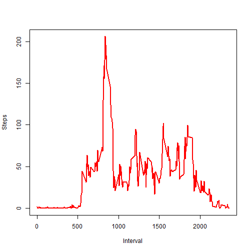

## Loading and preprocessing the data
Import raw data from csv file, convert date strings to date.

```r
activity <- read.csv('activity.csv')
activity$date <- as.Date(activity$date)
```

## What is mean total number of steps taken per day?
Plotting a logarithmic histogram, deriving mean & median steps, neglect NA entries.

```r
library(ggplot2)
ggplot(activity, aes(steps)) +
geom_histogram()+ scale_y_log10()
```

```
## `stat_bin()` using `bins = 30`. Pick better value with `binwidth`.
```

```
## Warning: Removed 2304 rows containing non-finite values (stat_bin).
```


```r
meanSteps <- mean(activity$steps, na.rm = TRUE)
medianSteps <- median(activity$steps, na.rm = TRUE)
```
The median steps were exactly 0 steps while the mean steps were 37 due to high outliers. 
# What is the average daily activity pattern?

```r
intervalSteps <- aggregate( steps ~ interval, activity, mean )
plot(intervalSteps, type='l',xlab= 'Interval', ylab='Steps', col='red' , lwd=2)
```



```r
maxInterval <- intervalSteps$interval[which.max(intervalSteps$steps)]
```
The 5-minute interval 835, on average across all the days in the dataset, contains the maximum number of steps.

## Imputing missing values

Note that there are a number of days/intervals where there are missing values (coded as ????????). The presence of missing days may introduce bias into some calculations or summaries of the data.


```r
missingAbs <- sum(!complete.cases(activity))
missingRel <- mean(!complete.cases(activity))
```

The total number of incomplete cases in the dataset (i.e. the total number of rows with NAs) amounts to 2304 or 13%.

A Strategy for filling in all of the missing values in the dataset is to use the median for that 5-minute interval.


```r
iMissing <- which(is.na(activity$steps))
intervalMissing <- activity$interval[iMissing]
stepsMissing <- intervalSteps$steps[match(intervalMissing,intervalSteps$interval)]
activityInterp <- activity
activityInterp$steps[is.na(activity$steps)] <- stepsMissing

ggplot(activityInterp, aes(steps)) +
geom_histogram()+ scale_y_log10()
```

```
## `stat_bin()` using `bins = 30`. Pick better value with `binwidth`.
```


```r
meanStepsInterp <- mean(activityInterp$steps, na.rm = TRUE)
medianStepsInterp <- median(activityInterp$steps, na.rm = TRUE)
totalDaily <- mean(aggregate( steps ~ date, activity, sum )$steps)
totalDailyInterp <- mean(aggregate( steps ~ date, activityInterp, sum )$steps)
```
The median steps in the interpolated dataset were exactly 0 steps (previously 0) while the mean steps were 37 (previously 37). So the interpolation by median values has no significant effect on these values.

There is no impact of inputing missing data on the estimates of the total daily number of steps (previously 10766, now 10766)

## Are there differences in activity patterns between weekdays and weekends?

For this part the weekdays() function may be of some help here. Use the dataset with the filled-in missing values for this part.


```r
weekEndDays <- c('Samstag', 'Sonntag')
#Use `%in%` and `weekdays` to create a logical vector
#convert to `factor` and specify the `levels/labels`
activityInterp$wDay <- factor((weekdays(activityInterp$date) %in% weekEndDays), levels=c(TRUE, FALSE), labels=c('weekend', 'weekday')) 
par(mfrow=c(2,1)) 
intervalStepsWeekend <- aggregate( steps ~ interval, activityInterp[activityInterp$wDay == 'weekend',], mean )
plot(intervalStepsWeekend, type='l',xlab= 'Weekend Interval', ylab='Steps', col='red' , lwd=2)
intervalStepsWeekday <- aggregate( steps ~ interval, activityInterp[activityInterp$wDay == 'weekday',], mean )
plot(intervalStepsWeekday, type='l',xlab= 'Weekday Interval', ylab='Steps', col='red' , lwd=2)
```


